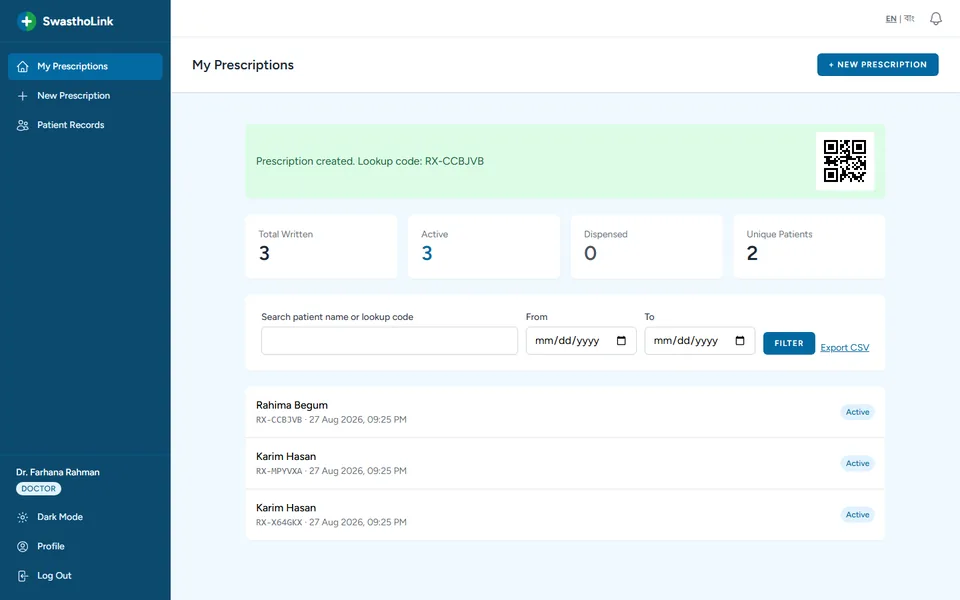
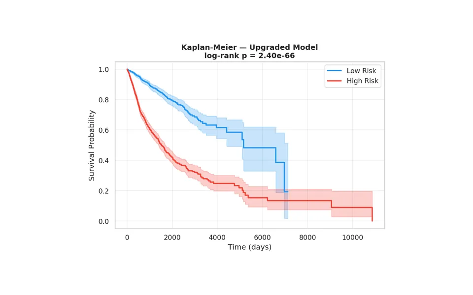
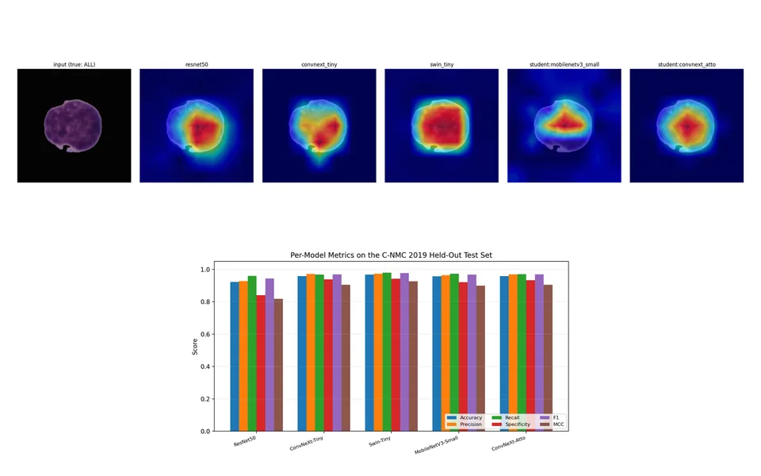
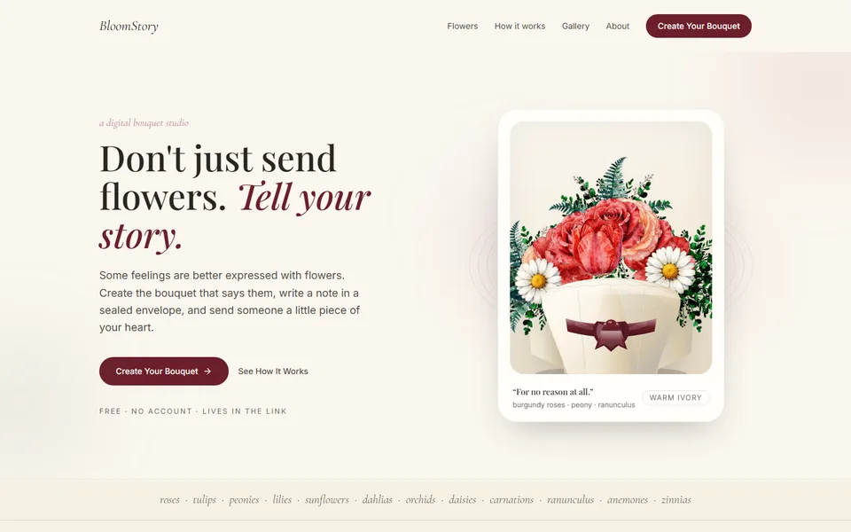
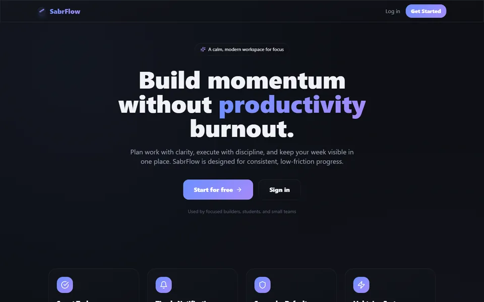
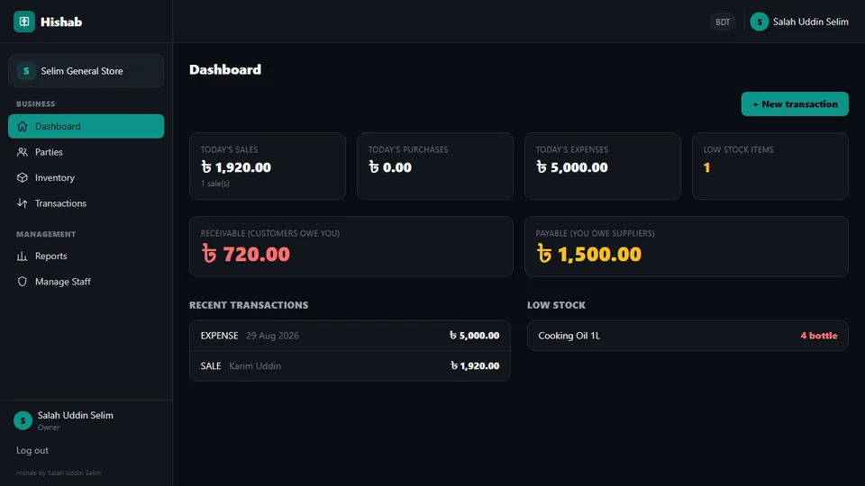
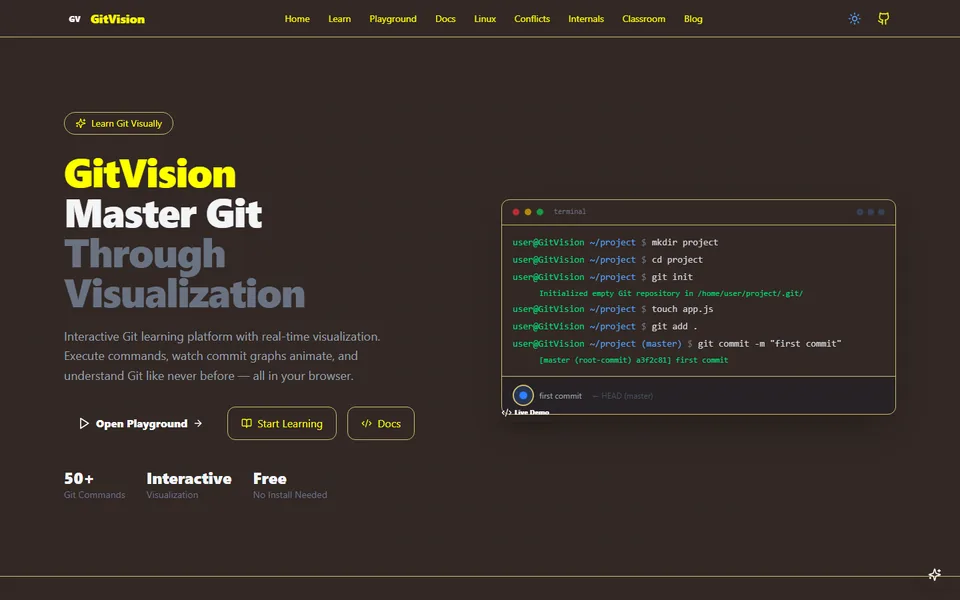
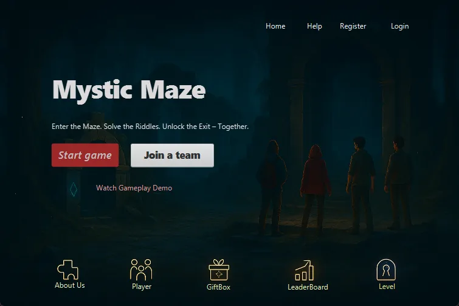

# Hi there, I'm Salah Uddin Selim 👋
### CSE Student @ UIU · Aspiring Data Analyst · Full-stack, IoT & AI

I am a Computer Science & Engineering student at United International University with a strong passion for data analysis, full-stack development, and machine learning. I love turning data into insight and building practical, robust applications that solve real-world problems.

🌐 **Portfolio:** [salah-uddin-selim.vercel.app](https://salah-uddin-selim.vercel.app)

---

### 🚀 About Me
- 📍 **Location:** Dhaka, Bangladesh (UTC +06:00)
- 🎓 **Education:** B.Sc. in Computer Science & Engineering, United International University
- 💼 **Experience:** Data Science Intern at CodeAlpha
- 🔬 **Research:** Multimodal deep learning for pan-cancer survival prediction · leukemia classification from blood-smear images
- 🤝 **Collaboration:** Open to internships and research opportunities in data analysis and ML
- 📫 **Reach Me:** selimsalahuddin19@gmail.com

---

### 🏆 Achievements
- 🥈 **6th Runner-Up, UIU Software Project Competition (Spring 2025)** for [Mystic Maze](https://github.com/salahuddinselim/PuzzleSolving-Game), a team-based multilevel puzzle game with real-time chat (Java, JavaFX, MySQL, sockets)
- 🎓 **Data Science Internship, CodeAlpha (2026)**: completed four ML and analysis projects: [car price prediction](https://github.com/salahuddinselim/CodeAlpha_Car_Price_Prediction), [Iris classification](https://github.com/salahuddinselim/CodeAlpha_Iris_Flower_Classification), [sales prediction](https://github.com/salahuddinselim/CodeAlpha_Sales_Prediction) and [unemployment analysis](https://github.com/salahuddinselim/CodeAlpha_Unemployment_Analysis)

---

### 💻 Featured Projects

<table>
<tr>
<td width="50%" valign="top">

<h4>🩺 <a href="https://github.com/salahuddinselim/SwasthoLink">SwasthoLink</a></h4>
Cryptographically verifiable e-prescriptions and medical records for doctors, pharmacists, hospitals and patients, in English and Bangla. RSA signatures, Diffie–Hellman sharing, 2FA and an admin audit log. 
<code>Laravel</code> <code>PHP</code> <code>MySQL</code> <code>Tailwind</code>
</td>
<td width="50%" valign="top">

<h4>🧬 <a href="https://github.com/salahuddinselim/Pancancer">Pan-Cancer Survival Prediction</a></h4>
Deep survival model fusing clinical, mRNA and miRNA data for 9,661 TCGA patients across all cancer types, benchmarked against Cox PH and Random Survival Forest (test C-index ≈ 0.77). 
<code>Python</code> <code>PyTorch</code> <code>DeepSurv</code> <code>SHAP</code>
</td>
</tr>
<tr>
<td width="50%" valign="top">

<h4>🔬 <a href="https://github.com/salahuddinselim/FYPD">Blood Cell Leukemia Classification</a></h4>
Final-year project: a ResNet50 + ConvNeXt + Swin teacher ensemble distilled into lightweight students that run on a CPU, with Grad-CAM explanations. 
<code>PyTorch</code> <code>Knowledge Distillation</code> <code>Grad-CAM</code>
</td>
<td width="50%" valign="top">

<h4>💐 <a href="https://bloomy-rho.vercel.app">BloomStory</a></h4>
A digital bouquet studio: arrange flowers, write a sealed note and share the whole gift as a single link. No accounts; the bouquet lives inside the URL. 
<code>Next.js</code> <code>TypeScript</code> <code>Framer Motion</code>
</td>
</tr>
<tr>
<td width="50%" valign="top">

<h4>✅ <a href="https://sabrflow.vercel.app">SabrFlow</a></h4>
A calm task manager with Google sign-in, smart reminders and push notifications. 
<code>Next.js</code> <code>TypeScript</code> <code>NextAuth.js</code>
</td>
<td width="50%" valign="top">

<h4>📒 <a href="https://github.com/salahuddinselim/Karbar">Hishab</a></h4>
Self-hosted single-store business manager: sales, expenses, inventory, invoicing and a customer/supplier credit ledger (khata). 
<code>PHP</code> <code>MySQL</code> <code>Tailwind</code>
</td>
</tr>
<tr>
<td width="50%" valign="top">

<h4>🌿 <a href="https://github.com/salahuddinselim/GitVision">GitVision</a></h4>
Learn Git visually: an in-browser Git simulator with animated commit graphs, docs and guided lessons. 
<code>Next.js</code> <code>TypeScript</code> <code>React</code>
</td>
<td width="50%" valign="top">

<h4>🧩 <a href="https://github.com/salahuddinselim/PuzzleSolving-Game">Mystic Maze</a> · 🏆 Award winner</h4>
Team-based desktop game with 5 logic puzzles, real-time chat and collaborative level unlocking. 
<code>Java</code> <code>JavaFX</code> <code>MySQL</code> <code>Sockets</code>
</td>
</tr>
</table>

<a href="https://salah-uddin-selim.vercel.app/projects">➡️ See all projects on my portfolio</a>

---

### 🛠️ Tech Stack

**Languages**

**Data Science & Machine Learning**

**Web & Backend**

**Databases & Tools**

---

### 🎯 Current Focus & Growth
- 📊 **Data Analysis:** Building fluency in SQL querying, data cleaning, and visualization with **pandas**, **NumPy** and Jupyter.
- 🤖 **Machine Learning:** Moving from coursework to research-grade work: survival analysis, knowledge distillation and model explainability in **PyTorch**.
- 🗄️ **Database Engineering:** Query optimization, indexing strategies and relational normalization in **MySQL**.
- 🧠 **Problem Solving:** Sharpening algorithms and data structures in **C++**.

---

### 📊 GitHub Activity

<picture>
  <source media="(prefers-color-scheme: dark)" srcset="https://raw.githubusercontent.com/salahuddinselim/salahuddinselim/output/github-contribution-grid-snake-dark.svg" />
  <source media="(prefers-color-scheme: light)" srcset="https://raw.githubusercontent.com/salahuddinselim/salahuddinselim/output/github-contribution-grid-snake.svg" />
  
</picture>

---

### 🤝 Let's Connect!

